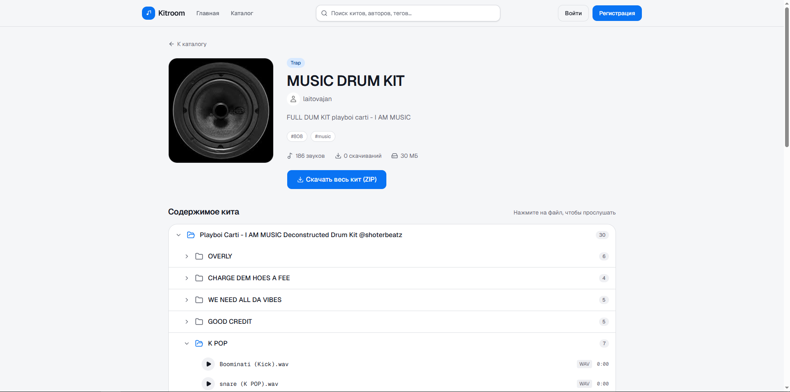

# Kitroom

**Kitroom** — платформа для загрузки, хранения и обмена драм-китами (наборами аудиосэмплов для битмейкеров и продюсеров).

Пользователь загружает ZIP-архив с сэмплами → сервис распаковывает его в фоне, строит дерево папок/файлов, извлекает метаданные аудио → другие пользователи могут просматривать кит как в проводнике, слушать сэмплы прямо в браузере и скачивать архив целиком.

Проект решает конкретную проблему битмейкеров: драм-киты обычно расшариваются через файлообменники и мессенджеры без предпросмотра содержимого — приходится скачивать весь архив, чтобы понять, что внутри. Kitroom даёт браузерный предпросмотр дерева файлов и прослушивание сэмплов до скачивания.

Демо сайта: https://frontend-production-6aad.up.railway.app/

---

## Стек технологий

**Backend**


**Frontend**


**Инфраструктура и интеграции**


---

## Функциональность

- **Загрузка китов ZIP-архивом** — с прямой загрузкой в S3 по presigned URL, минуя backend (быстрее и без нагрузки на сервер при больших файлах)
- **Фоновая обработка архива**: распаковка, валидация файлов, разбор структуры папок, подсчёт количества сэмплов — пользователь в это время видит статус (`pending → processing → ready / failed`)
- **Дерево файлов кита** — навигация по вложенным папкам как в обычном проводнике, без необходимости скачивать архив
- **Прослушивание сэмплов** прямо в браузере и скачивание кита целиком
- **Каталог китов** с собственной страницей кита (обложка, жанр, теги, описание, счётчик скачиваний)
- **Личный кабинет**: список своих китов, редактирование метаданных, удаление
- **Авторизация**:
  - email + пароль с подтверждением почты 6-значным кодом
  - вход через Google (OAuth2, redirect-флоу)
  - JWT access/refresh токены с автоматическим обновлением сессии на фронтенде
  - восстановление пароля по коду на почту
- **Rate limiting** на регистрации, логине, восстановлении пароля — защита от брутфорса и спама
- **Переключаемое хранилище файлов**: локальный диск для разработки или S3-совместимое хранилище (Cloud.ru B2) для продакшена — одна переменная окружения, без изменений в коде

## Демонстрация



---

## Инструкция по запуску

### Через Docker (рекомендуется)

```bash
git clone https://github.com/Geekyup/Kitroom.git
cd Kitroom
cp .env.example .env   # заполнить переменные окружения, см. ниже
docker compose up --build
```

- Backend API: `http://localhost:8000` (Swagger-документация: `/docs`)
- Frontend: `http://localhost:3000`

`docker-compose.yml` поднимает пять сервисов: `postgres`, `redis`, `migrate` (одноразовое применение Alembic-миграций), `api`, `worker`, `frontend`.

### Локально, без Docker

Требуется: Python 3.12+, Node.js 20+, запущенные PostgreSQL и Redis.

```bash
# Backend
pip install -r requirements.txt
alembic upgrade head
python -m app.main              # API на :8000

# Worker (в отдельном терминале)
python -m arq app.worker.settings.WorkerSettings

# Frontend (в отдельном терминале)
cd frontend
npm install
npm run dev                     # UI на :3000
```
### Тесты

```bash
py -m pytest tests/ -v
```

### Основные переменные окружения

| Переменная | Описание |
|---|---|
| `DATABASE_URL` | строка подключения к PostgreSQL |
| `REDIS_URL` | строка подключения к Redis |
| `SECRET_KEY`, `SESSION_SECRET_KEY` | секреты для JWT и сессий OAuth |
| `GOOGLE_CLIENT_ID`, `GOOGLE_CLIENT_SECRET`, `GOOGLE_REDIRECT_URI` | Google OAuth |
| `RESEND_API_KEY`, `EMAIL_FROM` | отправка писем (подтверждение почты, сброс пароля) |
| `STORAGE_BACKEND` | `local` или `b2` — переключатель хранилища файлов |
| `B2_KEY_ID`, `B2_APPLICATION_KEY`, `B2_BUCKET_NAME`, `B2_ENDPOINT_URL`, `B2_REGION` | обязательны при `STORAGE_BACKEND=b2` |
| `MAX_ZIP_SIZE_MB`, `MAX_FILES_PER_KIT` | лимиты на загружаемый архив (по умолчанию 500 МБ / 2000 файлов) |

Полный список — в `app/core/config.py`.

---

## Архитектура и компромиссы

### Слоистая архитектура backend

```
router → service → repository → db
```

Роуты (`app/api/v1`) не содержат бизнес-логики — только валидацию входа и вызов сервиса. Сервисы (`app/services`) содержат бизнес-правила и оркестрируют репозитории. Репозитории (`app/repositories`) — единственное место, где есть SQL-запросы. Такое разделение усложняет самые простые CRUD-эндпоинты (лишний слой абстракции), но окупается на кросс-сущностной логике вроде обработки кита, где нужно согласованно трогать киты, ноды дерева файлов и хранилище.

### Обработка архивов — асинхронно через очередь, а не в запросе

Распаковка и валидация ZIP-архива (до 500 МБ, до 2000 файлов) может занимать существенное время — держать HTTP-запрос открытым всё это время не вариант. Поэтому обработка вынесена в отдельный **ARQ-воркер**, а API только ставит задачу в очередь и сразу отвечает клиентом статусом `pending`. Фронтенд опрашивает `/kits/{slug}/status`, пока кит не перейдёт в `ready` или `failed`.

Выбор в пользу **ARQ, а не Celery**: ARQ — асинхронный «из коробки» (построен на asyncio и redis, тот же стек, что у остального backend), не требует брокера отдельно от Redis, и его конфигурация проще для проекта такого масштаба. Расплата — экосистема беднее (нет встроенного мониторинга уровня Flower, меньше community-инструментов), что для одного типа фоновой задачи в проекте — приемлемый компромисс.

Воркер сознательно ограничен `max_jobs = 1`: параллельная обработка нескольких китов (каждый может весить сотни МБ) на контейнере с ограниченной памятью рискует упереться в OOM. Пока память контейнера не увеличена — это осознанное ограничение пропускной способности ради стабильности, а не забытая настройка.

### Переключаемый storage backend вместо жёсткой привязки к S3

Хранилище файлов спрятано за единым интерфейсом (`save_upload`, `get_url`, `head_object`, `generate_upload_key` и т.д.), у которого два взаимозаменяемых backend'а: локальный диск и S3-совместимое хранилище (Cloud.ru B2). Выбор — одна переменная окружения `STORAGE_BACKEND`, без правок кода сервисов.

Причина: локальный диск удобен для разработки и не требует внешних credentials, чтобы поднять проект и потыкать API; S3 нужен в продакшене ради масштабируемости и presigned-URL загрузки напрямую с клиента. Компромисс — два backend'а нужно поддерживать синхронно (любая новая операция storage должна быть реализована в обоих), и у локального диска нет presigned-механизма «из коробки» — под него написан отдельный PUT-эндпоинт-имитация (`app/api/v1/storage_local.py`), что добавляет специфичный для local-режима код.

### Presigned-загрузка, а не multipart через backend

Основной флоу загрузки — клиент получает presigned PUT URL и льёт файл напрямую в S3, backend в этом не участвует. Старый multipart-флоу (файл идёт через FastAPI) оставлен в коде как fallback, но не является основным путём: он держит соединение с backend открытым на всё время аплоада и ограничен памятью/таймаутами сервера — неприемлемо для архивов в сотни мегабайт.

### JWT-токены Google OAuth передаются через hash-фрагмент URL, а не query-параметр

После Google-логина backend не может отдать JSON браузеру напрямую (это редирект, а не fetch-запрос), поэтому токены передаются через `#access_token=...&refresh_token=...` в URL. Hash-фрагмент, в отличие от query-параметра, не уходит на сервер (не попадает в логи nginx/uvicorn и в заголовок `Referer`) — фронтенд читает его на клиенте через `window.location.hash`